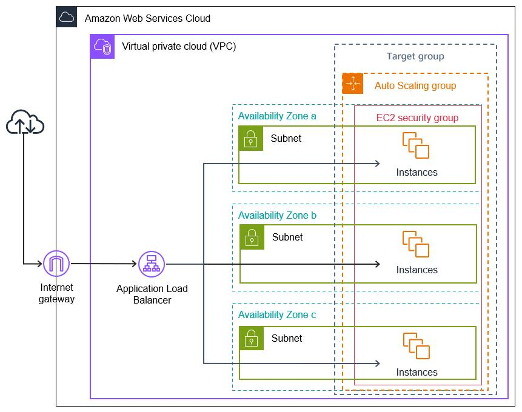
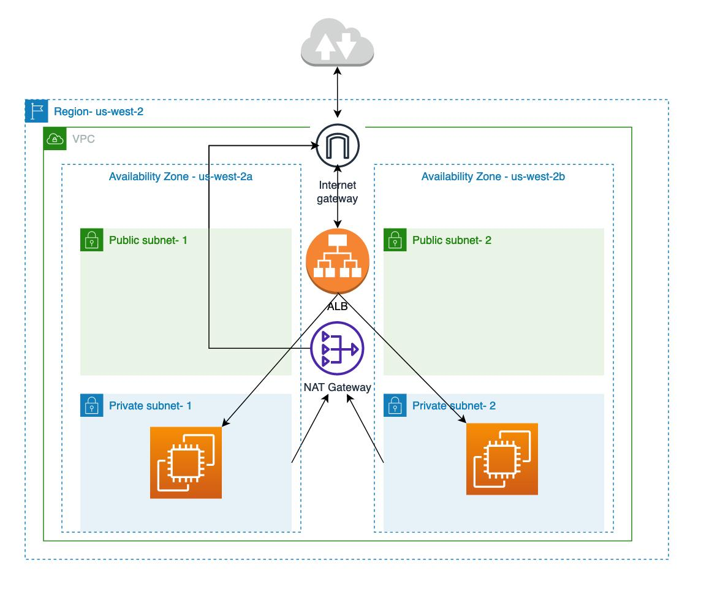

# 🚀 3-Tier Architecture Deployment on AWS (With Load Balancer & Auto Scaling)

## 📌 Project Overview

This project demonstrates a **highly available 3-tier architecture** deployed on AWS using cloud best practices.

The architecture includes:

* **Presentation Layer (Frontend / Web Tier)**

* **Application Layer (Backend)**
* **Database Layer (PostgreSQL)**
* **Load Balancer for traffic distribution**
* **Auto Scaling for high availability**

---

## 🏗️ Architecture Diagram



---

## ⚙️ Technologies Used

* ☁️ AWS (EC2, VPC, Subnets, Security Groups)
* 🌐 Application Load Balancer (ALB)
* 📈 Auto Scaling Group (ASG)
* 🐳 Docker (optional)
* 🌐 Nginx (optional reverse proxy)
* ☕ Spring Boot (Backend)
* 🐘 PostgreSQL (Database)

---

## 🌐 Architecture Flow

```
User → Load Balancer → Auto Scaling EC2 → Application → Database
```

---

## 🧩 Architecture Details

### 1️⃣ VPC Setup

* Custom VPC with CIDR block
* Public and Private Subnets
* Internet Gateway attached
* NAT Gateway for private subnet access

---

### 2️⃣ Load Balancer Layer

* Application Load Balancer (ALB)
* Internet-facing
* Distributes traffic across multiple EC2 instances
* Health checks enabled

---

### 3️⃣ Web/App Tier (Auto Scaling)

* EC2 instances managed by Auto Scaling Group
* Runs:

  * Nginx (optional)
  * Spring Boot application
* Instances distributed across multiple subnets

---

### 4️⃣ Database Tier

* PostgreSQL running on EC2 (Private Subnet)
* Not publicly accessible
* Access allowed only from App Tier

---

## 🔐 Security

* Only Load Balancer exposed to internet
* EC2 instances are private
* Database restricted via Security Groups
* SSH access limited

---

## 🚀 Deployment Steps

### Step 1: Create AMI

* Create image from configured EC2 instance

---

### Step 2: Create Launch Template

* Use created AMI
* Configure instance type and security groups

---

### Step 3: Create Target Group

* Protocol: HTTP
* Port: 80 or 8080
* Add health check path (`/` or `/actuator/health`)

---

### Step 4: Create Load Balancer

* Type: Application Load Balancer
* Internet-facing
* Attach Target Group

---

### Step 5: Create Auto Scaling Group

* Attach Launch Template
* Attach Target Group
* Configure:

  * Min: 2
  * Desired: 2
  * Max: 4

---

### Step 6: Configure Scaling Policy

* Target Tracking Policy
* CPU Utilization: 60%

---

### Step 7: Configure Application

* Update backend DB connection:

```
spring.datasource.url=jdbc:postgresql://<DB_PRIVATE_IP>:5432/mydb
spring.datasource.username=admin
spring.datasource.password=password
```

---

## 🔗 Application Access

* Application URL → Load Balancer DNS
* Backend & DB → Private Access Only

---

## 📸 Screenshots

Add screenshots:

* EC2 instances
* Load Balancer
* Auto Scaling Group
* VPC setup

---

## 📈 High Availability Features

### Load Balancer

* Distributes incoming traffic
* Prevents single point of failure

### Auto Scaling

* Automatically adds/removes instances
* Handles traffic spikes efficiently

### Benefits

* High availability
* Fault tolerance
* Scalability
* Cost optimization


## 👨‍💻 Author

**Arman Shaikh**
